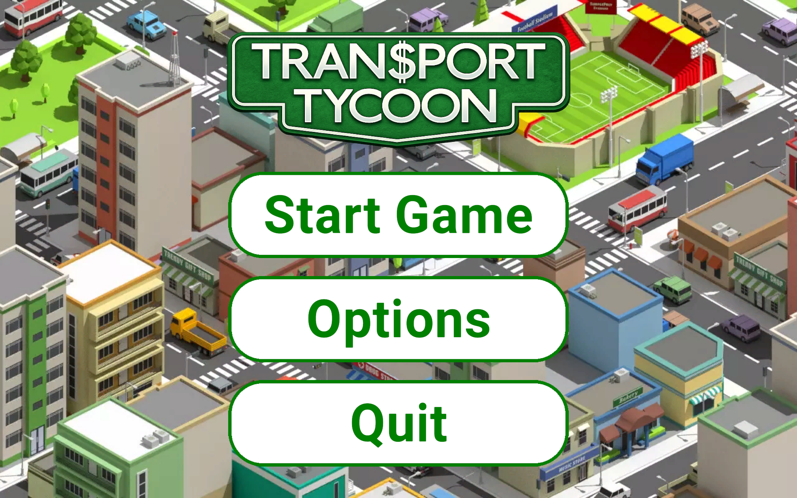
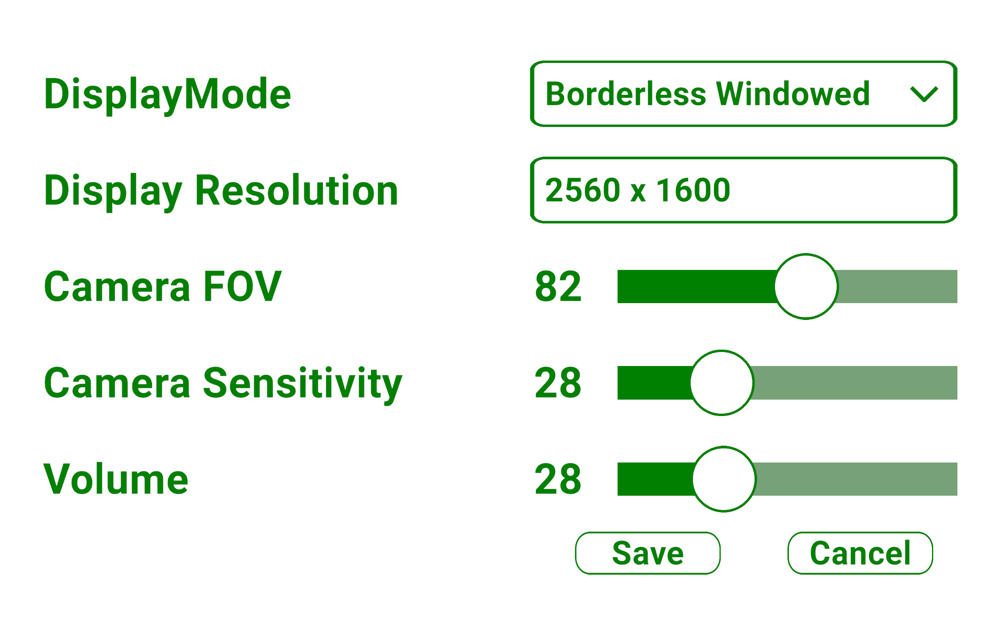
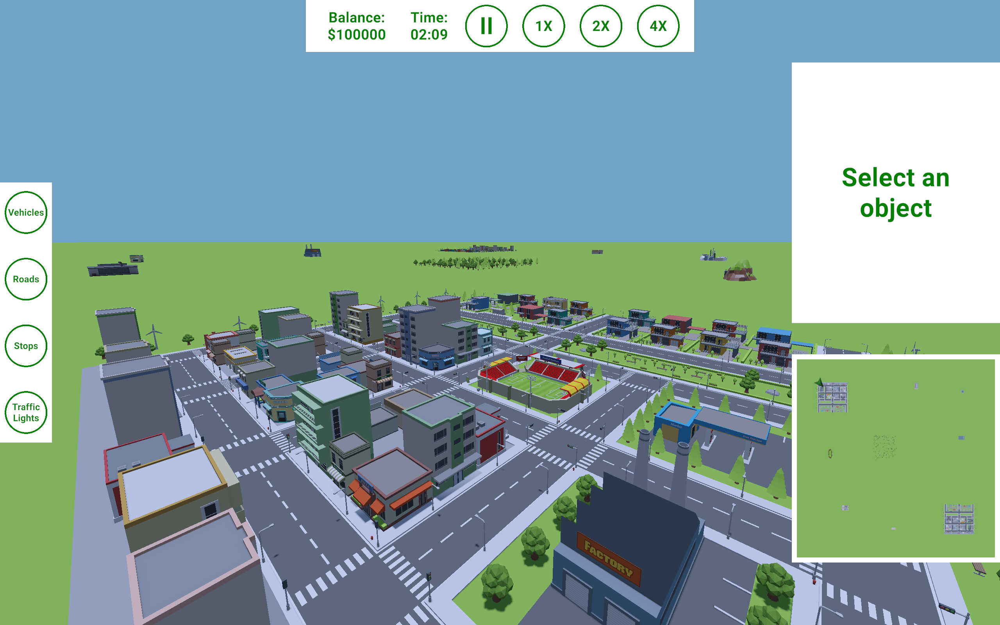
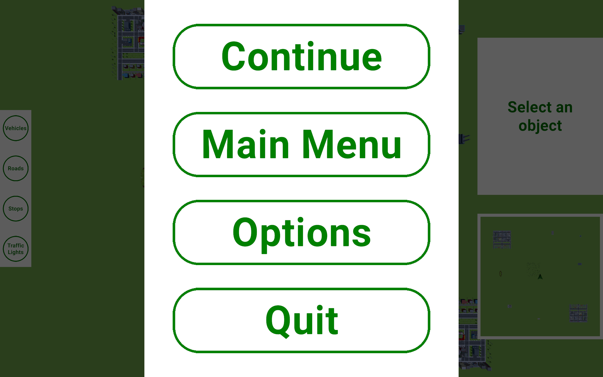
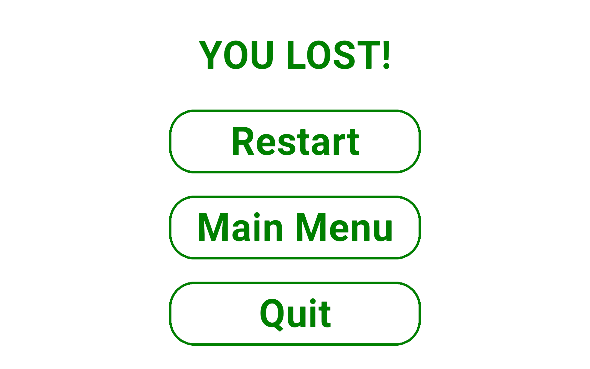

# Transport Tycoon

## Team: Pyramids

### Team Members
**- Hassan Ibrahim**   
**- Omar Ahmed**   
**- Ayman Eldaly**   
**- Anas Obaid**

---

## Game Description

We are implementing a simplified transport-economic simulation game inspired by Transport Tycoon.

The player builds road infrastructure, places stops, purchases vehicles, defines circular routes, and transports goods and passengers in order to maximize profit.

The simulation runs in real time on a procedurally generated grid-based 3D map. The game includes terrain elevation, traffic control, economy management, and infrastructure planning. The game ends when the player goes bankrupt.

---

## Selected Subtasks

- Traffic Lights (1)
- 3D Graphics (1)
- Continuous Movement (0.5)
- Minimap (0.5)
- Forests (0.5)

**Total Complexity: 5**

---

## Programming Language and Libraries Used

### Programming Language
- C#

### Game Engine
- Unity (LTS)

### Core Libraries
- UnityEngine (core engine framework)
- Unity UI system (for graphical user interface)
- Unity Input System (for handling player input)

### Development Tools
- Visual Studio Code
- Git (version control)
- GitLab (repository hosting and project management)

### Target Platform
- Windows Desktop

---
## In Game Images

### Main Menu

### Options Menu

### Game View

### Pause Menu
    

### End Screen

---
## License

This project is licensed under the Creative Commons Attribution-NonCommercial-NoDerivatives 4.0 International License.

See: https://creativecommons.org/licenses/by-nc-nd/4.0/
